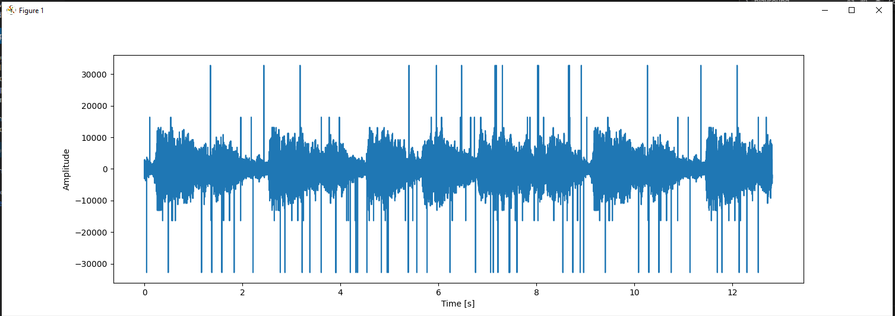

# Audio-Restoration using median filter and cubic_splines

## High-level Description of the project
This assignment builds on Assignment I. We assume that we have successfully detected the clicks and we are applying different interpolation methods to restore the audio, such as
- median filtering
- cubic splines

## Introduction

Audio restoration is critical to signal processing, addressing challenges such as noise reduction and reconstruction of distorted samples. 
The assigned Task 2 is about dealing with clicks using median filtering and cubic spline interpolation, in the context of audio signal enhancement.
Through their distinct approaches, these methods aim to refine audio quality by mitigating noise and interpolating missing or distorted components.

## Background

After performing AR interpolation in Matlab gave a clear idea regarding the positions of 
the clicks and estimated and replaced the value in the place of clicks. The position of the 
clicks is downloaded from Matlab, which is further used in median filtering and cubic spline.

## Installation and Execution

The library requirements are 
```sh                                 
 sklearn.metrics
 scipy.io
 numpy
 scipy.interpolate
 matlplotlib
 tqdm
 playsound

```
For more details check [here](https://github.com/bndr/pipreqs)


Afer installing all required packages you can run the demo file simply by typing:
```sh
python Median_Filter.py
python cubic_spline.py
```
---

## Methodology and Results
### Audio Restoration using Median Filter

Median filtering is a nonlinear filtering technique commonly used in image and signal processing. It replaces each sample in a signal with the median value of neighboring samples within a specified window. Median filtering proves effective in reducing impulse noise and outliers. By identifying and replacing extreme values with the median, the algorithm mitigates the impact of sudden spikes or drops in the audio signal.

- #### Steps:


  - ##### **Filtering Process:**
     - Utilizes zero padding for handling edge effects during median filtering.
     - `apply_median_filter` function is employed for filtering around detected click positions, leading to signal restoration.

  - ##### **Visualizations:**
      - Generates visualizations of the original degraded signal and the restored signal using Matplotlib.

- #### Metrics:

   - Calculates mean squared error (MSE) between the restored and clean audio as a quantitative measure of restoration quality.

- #### Output:

   - Saves restored and degraded audio signals as WAV files.

- #### Feedback:

   - Auditory evaluation facilitated by the `playsound` library.
   - Unit tests using the `unittest` library ensure the correctness of the filtering process.

- #### Approach:

  - Offers a comprehensive approach to audio restoration with a median filter.
  - Combines visualizations, quantitative assessments (MSE calculation), and auditory feedback for enhanced quality.


### Audio Restoration using Cubic Splines

Cubic spline interpolation is a mathematical method used to construct a smooth curve that passes through a set of given points. It is particularly useful for interpolating missing samples in a signal. Cubic spline interpolation can be applied to reconstruct missing or distorted audio samples. By fitting a cubic spline curve to the existing data points, the algorithm estimates the values of missing samples, contributing to a more continuous and coherent audio signal. 


- #### **Steps:**
  - Load degraded and clean audio.
  - Visualize degraded signal.
  - Detect error positions based on precomputed clicks.
  - Apply cubic spline for smoothing and restoration.

- #### **Metrics:**
  - Measure filter duration.
  - Calculate MSE for restoration quality.

- #### **Output:**
  - Save as "restored_audio_cubic.wav."

- #### **Feedback:**
  - Play both degraded and restored audio.

- #### **Approach:**
  - Comprehensive: combines visualization, MSE analysis, and auditory feedback.


## Results and Plots

#### Degraded Audio



### Median filter 

   - #### window size =13
     The MSE for this window size is 1.9731936009336652


  - #### window size = 5
    The MSE for this window size is 1.9135132955071004. Even though the MSE is lesser than window size 7, the clicks were heard.
    


   - #### window size = 7
     The MSE for this window size is 1.9269091776579117    T


### MSE VS WINDOW SIZE


   


### Cubic spline
The MSE for the Cubic spline is 0.0024111729368456597


## Conclusion

Both the cubic spline interpolation and the median filter have successfully repaired damaged audio, resolving problems like clicks. Impulse noise can be effectively reduced by the median filter, and the smooth reconstruction of deformed or missing samples is guaranteed by cubic spline interpolation. These methods show how effective they are at accomplishing successful audio restoration through visuals, numerical measurements, and audio evaluations.


## Credits


This code was developed for purely academic purposes by sraparna79 as part of the Computational Methods (5c22) module. 

Resources:

 - Dr. Libin Mathew Lecture Notes.
 - Mr. Darren Ramsook and Mr. Vibhoothi for Lecture notes and Python
 - Changhong Li for calculating Mean squared error.
 - https://pythonnumericalmethods.berkeley.edu/notebooks/chapter17.03-Cubic-Spline-Interpolation.html
 - https://machinelearning1.wordpress.com/2014/07/13/signal-processing-apply-median-filters-python/
 - https://docs.scipy.org/doc/scipy/reference/generated/scipy.interpolate.CubicSpline.html
  


